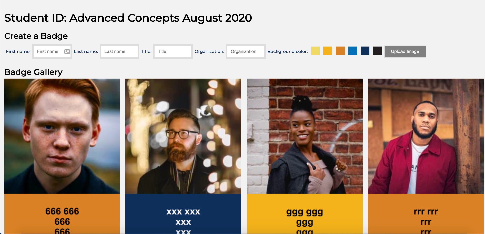
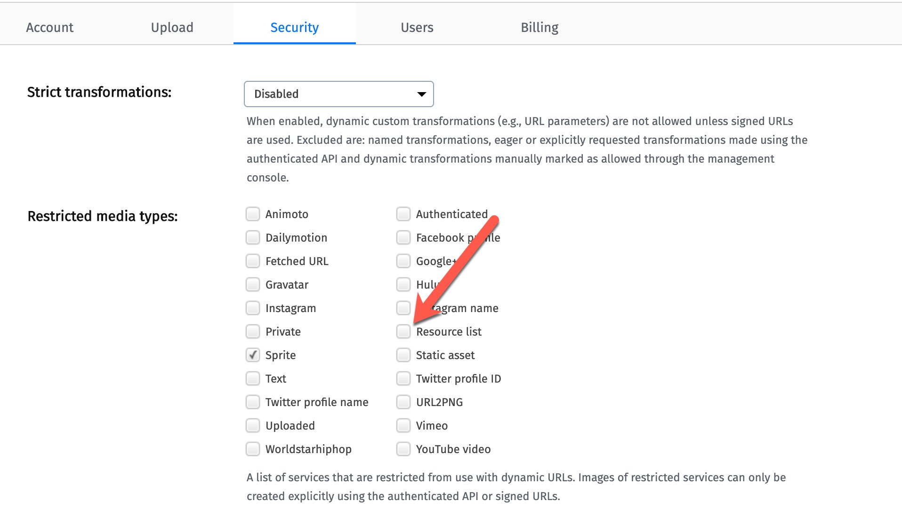

# Virtual Student ID Badge

<a href="https://www.beckypeltz.me/student-id/index.html?cn=pictures77&title=Advanced%20Concepts&date=August%202020" target="_blank">Demo</a>



You can use your Cloudinary account as a Database for student images and information that will go into creating an ID badge.  

This web application can be harnessed to upload student information to the Cloud and create a web page with all student image and data made publicly available on the Web.

The script for the Web page will expect a query string with `cn:cloud_name` key/value pair.  The cloud_name supplied represents a Cloudinary cloud specific to a course.  

The steps to prepare for for using this app are: 

1. Create a Cloudinary cloud.  Copy the CLOUDINARY_URL into a .env file.
2. Run the script `create-student-id-preset.js`.  This script sets up instructions for cropping, folder-ing and tagging the images uploaded.  note: The upload script will also add user supplied context data and require that the image uploaded contains a face.  The folder and tag are the same: **student-id**.
```bash
node create-student-id-preset.js
```
3. Run the script `create-named-badge-xform-color.js`. This script will create the transformation that will overlay student supplied data: name, title, organization to the badge, as well as apply background and foreground color to the student information.
```bash
node create-named-badge-xform-color.js
```
4. Supply a URL to students for a particular course like this: 
```bash
https://path.to.app/index.html?cn=cloud_name&title=course%20title&date=course%20date
```
Use the Cloud Name for the cloud you created in step 1 for **cn**.  Add a URL encoded string for **title** and **date**.  The title and date should show up in your header.
5. We are adding a version with current epoch time to bust the cache so that we can pick up new images with the **student-id** tag without running into caching problems.  
You can also accomplish cache busting with a setting in your cloud.  You need to get support to help with that and it shouldn't be necessary. Cloudinary admin cloud setting for list sync: 

6. In order to use the list API which gathers up images by tag (**student-id**), you need to uncheck the list resources in settings | security.


## Example:
To use the following specifications for collecting data:
- cloud name: `student-id-test`
- course title: Student ID Test
- course date: July 2020

Use the following URL

https://studentid.cloudinary.training/index.html?cn=student-id-test&title=Student%20ID%20Test&date=July%202020
